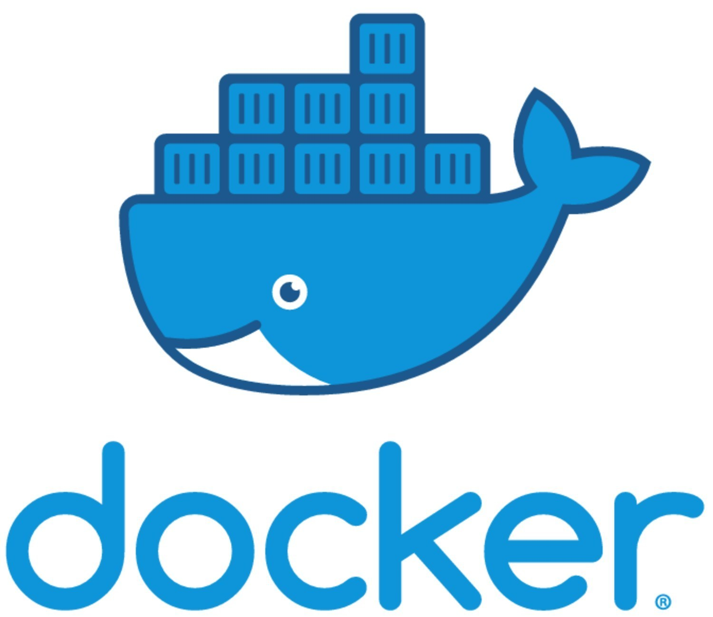

<br />
<p align="center">
  <a href="https://github.com/othneildrew/Best-README-Template">
    
  </a>
  <h3 align="center"> Docker - Laboratório e Aprendizado </h3>
  <h3 align="center"> Todo esse laboratório é baseado nos treinamentos do https://www.linuxtips.io/ </h3>
</p>


### Parametro para executar um contair é o $docker run

```sh

docker run hello-world

```
#### Ele irá até o docker hub, fará download do container e irá executar. Caso seja dado #docker ps ele não irá aparecer, pois ele ja executou a sua função e fechou.

```sh

docker ps

```

### Para mostrar todas as imagens no S.O

```sh

docker images

```

### Visualizar todos os containers da máquina, mesmo parados e finalizados (Atenção é importante administrar container parados e antigos)

```sh

docker ps -a

```

### Parametros do docker run

```sh

-t permiti o terminal
-i permiti interação com container
-d rodar como daemon (processo)

```

### Exemplo:

```sh

docker run -ti ubuntu /bin/bash

```

- OBS:. quando nenhum parametro é passado o shell é iniciado como padrão no docker run

       - Apertando CTRL+D mata o shell e fecha o container
       - Apertando CTRL+PQ sai do container e mantem rodando

### Para voltar ao container, basta dar attach no mesmo

```sh

docker attach <CONTAINER ID>

```

### Para criar um container (Ele não é executado)

```sh

docker create <nome_do_container>
docker run -ti <nome_do_container>

```
### Parar um container

```sh

docker stop <CONTAINER ID>

```

### Iniciar um containers

```sh

docker start <CONTAINER ID>

```

### Pausar um container

```sh

docker pause <CONTAINER ID>

```

### Despausar um container

```sh

docker unpause <CONTAINER ID>

```

### Verificar os recursos consumidos pelo container

```sh

docker stats <CONTAINER ID>

```

### TOP do docker para mais detalhes do containers

```sh

docker top <CONTAINER ID>

```

### Verificar as logs de um container

```sh

docker logs <CONTAINER ID>

```

### Deletar um container

```sh

docker rm <CONTAINER ID>

```

  - OBS:. Se o container estiver em execução você não consegue remove-lo, sendo necessário dar um stop ou usar o parametro -f de force


### Limitação de Recursos nos Containers

       - Caso não seja passado nenhuma limitação, o container nao terá limites de utilização de recursos
       - Para monitorar os recursos utilizamos:

```sh

docker run -ti --name teste debian
docker inspect <CONTAINER ID>

```
- Informações de memória do containers
  
```sh

docker inspect <CONTAINER ID> | grep -i "mem"

```
  - Quando a primeira linha memory está com valor 0, quer dizer que não há limitação de utilização de memoria

### Criando a limitação de memória para o exemplo de 512MB

```sh

docker run --memory 512m --name teste_memoria centos <CONTAINER ID>

```

  - Executando o mesmo comando anterior para fazer o inspect é possivel ver que o campo memoria ficou agora limitado aos 512MB

### Alterando memória de um container já em execução para 256MB

```sh

docker update --memory 256m <CONTAINER ID>

```
### Limitando recursos de CPU

```sh

docker run -ti --cpu<cores> <n> <CONTAINER ID> --name teste_cpu centos

```
  - Fazer a verificar do recurso de CPU com o inspect
  
```sh

docker inspect <CONTAINER ID> | grep -i "cpu"

```

  - Atualizar a limitação de CPU com container em execução

```sh

docker update --cpu 0.5 <CONTAINER ID>

```
  - Verificar a limitação de CPU

```sh

docker inspect <docker_name | CONTAINER ID | grep -i "cpu"

```
### Volumes e container data-only


```sh

docker run -ti --volume /teste_fs centos /bin/bash

```
  - Será criado uma nova montagem no local indicado, que será o volume persistente do container

  - Para verificar o volume criado, utilizaremos o Inspect do Docker

```sh

docker inspect <docker_name | CONTAINER ID> -f {{.Mounts}}

```

  - Caso não seja feito o mapeamento de onde o diretorio será montado, o proprio docker irá realizar a ação. Porém é possivel apontar o local que verá ser feito o mapeamento

```sh

docker run -ti -v /root/primeiro_dockerfile:/volume_container debian

```

  - Com o comando assim indicamos que o diretorio que deve ser mapeado no host pelo Docker será o primeiro_dockerfile e a montagem no container terá o nome volume_container e ficará no /

### Container Data-Only

  - Container sem a necessidade de estar em execução, onde ele possuirá volumes que serão compartilhados com outros containers

  - Primeiro vamos criar os containers não executa-lo.
  
```sh

docker create --volume /data --name dbdados ubuntu 

```

  - Agora iremos utilzar esse volume criado no container anterior para apontar para os proximos

OBS:. Paramentros novos:

-p -> expor uma porta para o container
-e -> setar a variavel de ambiente
-d -> rodar como daemon
--volumes-from -> aponta qual será o container data-only

  - Subindo 2 containers:

```sh

docker run -d \
-p 5432:5432 \
--name pgsql1 \
--volumes-from dbdados \
-e POSTGRESQL_USER=docker \
-e POSTGRESQL_PASS=docker \
-e POSTGRESQL_DB=docker \
kamui/postgresql

```

```sh

docker run -d \
-p 5433:5432 \
--name pgsql2 \
--volumes-from dbdados \
-e POSTGRESQL_USER=docker \
-e POSTGRESQL_PASS=docker \
-e POSTGRESQL_DB=docker \
kamui/postgresql

```

  - É possivel verificar agora os 2 containers gravado os dados no volume do primeiro container utilizando o comando #docker inspect dbdados -f {{.Mounts}}
  
  ###Efetuando a criação de Dockerfiles
  
  - Parametros do DockerFile
  
    - FROM -> Primeiro parametro passado ao DOCKERFILE, parametro que aponta qual a imagem usada como base para montar a sua imagem
    
    - MAINTAINER -> Escrito do Dockerfile
    
    - ADD -> Joga um arquivo do host para dentro do container e arquivos empacotados também
    
    - LABEL -> Função de colocar Metadata (Versões, Fabricantes, Descrição)
    
    - COPY -> Função de copiar arquivos e diretorios para dentro do container
    
    - ENTRYPOINT -> Permite que um processo seja o principal dentro do container (Caso ele paro ou morra, o container morre):Exemplo colocando o apache como                                 entrypoint e caso ele morra, o container para.
    
    - CMD -> Parametro do EntryPoint
    
    - ENV -> Determina variaveis de ambiente para o container
    
    - EXPOSE -> Mostra qual porta do container está disponivel para acesso  e precisar ser exposta
    
    - RUN -> permite a execução de instruções dentro do container(Muito usado para efetuar a instalação de pacotes) OBS:. quanto menos RUN melhor, ou seja menos camadas. É importante que somente a camada de cima (Ultima executada tem direito write, a anterior vira read-only).
    
    - USER -> usuário para aquela imagem de container, se nada for associado será utilizado root
    
    - VOLUME -> Volume criado para o container
    
    - WORKDIR -> Aponta qual diretorio raiz do container
    
###Processo de Build utilizando Dockerfile
    
    - É preciso passar o nome da imagem parametro -t e também a versão parametro usando : após o nome da IMG
    - Voce não aponta diretamente o docker file, mas sim o local do seu diretorio. Exemplo abaixo .
    
```sh

docker build --file DockerFile -t "minhapri:1.0" .

```

  - DockeFile utilizado de exemplo:
  
```sh 

Dockerfile:
FROM debian
MAINTAINER Felipe Dias
RUN apt-get update -y && \
apt-get install -y apache2 && \
apt-get clean
LABEL Description="Primeiro apache"
ENTRYPOINT ["/usr/bin/apachectl", "-D", "FOREGROUND"]
ENV user="Felipe"
EXPOSE 80
USER $user
VOLUME /Apache
WORKDIR /Apache

```    

### Executando os dockerfiles

  
```sh 

mkdir -p /root/dockerfiles/Apache
cd /root/dockerfiles/Apache
docker build -t webserver:1.0 .
docker run -ti webserver:1.0
#Ponto importante, não definimos na criação do container para rodar o serviço do apache, então será necessário realizar manualmente dentro do container: #service apache2 start

```   
  -Dockerfile criado no exercício

```sh 

Dockerfile:
FROM debian
RUN apt-get update -y && \
apt-get install -y apache2 && \
apt-get clean
ENV APACHE_LOCK-DIR="/var/lock"
ENV APACHE_PID_FILE="/var/run/apache2.pid"
ENV APACHE_RUN_USER="www-data"
ENV APACHE_RUN_GROUP="www-data"
ENV APACHE_LOG_DIR="/var/log/apache2"
LABEL Description="Webserver"
VOLUME /var/www/html
EXPOSE 80

```

### Visualizar as camadas do container

```sh 

docker history <image>

```
### Apagar IMAGE

```sh 

docker rmi -f <IMAGE_ID> || tag

```

### Docker Hub (Ponto importante para subir uma image para o Docker HUB precisar seguir a notação de utilizar o user/tag)

  - Alterar a tag do container (-t do build)

```sh 

docker tag <IMAGE_ID> lipenodias/webserver:1.0
docker login
docker push <IMAGE_ID> | docker push <user/tag>

  #procurar repositorio
docker search lipenodias

  #baixar image do docker hub 
docker pull user/tag

```

# Dockerfile criado no lab anterior

```sh 

Dockerfile:
FROM debian
RUN apt-get update -y && \
apt-get install -y apache2 && \
apt-get clean
ENV APACHE_LOCK_DIR="/var/lock"
ENV APACHE_PID_FILE="/var/run/apache2.pid"
ENV APACHE_RUN_USER="www-data"
ENV APACHE_RUN_GROUP="www-data"
ENV APACHE_LOG_DIR="/var/log/apache2"
ENV APACHE_RUN_DIR="/var/run/apache2"
LABEL Description="Webserver"
ENTRYPOINT ["/usr/sbin/apachectl"]
CMD ["-D", "FOREGROUND"]
VOLUME /var/www/html
EXPOSE 80

```

# Metodo de distribuição local DOCKER Registry(Distribution)
  - Solução muito utilizando em meios corporativos em alternativa ao Docker HUB
  - Pegamos a ultima image do Docker Hub para o registry
  - Antes de subirmos no registry precisamos seguir o padrão de tag <ServerName:Port/(image_name)>

```sh 

docker run -d -p 5000:5000 --restartlways --name registry registry:latest
docker images
docker tag <IMAGE_ID> localhost:5000/webserver:1.0
docker push <IMAGE_tag>

#visualisar todas as images

curl localhost:5000/v2/_catalog

```
# Configuração de rede dos containers

- Parametros
  
  - --dns --> passe o servidor DNS 
  - --hostname --> defini o hostname para o container
  - --link --> Faz o link entre containers
  - --expose --> Expõe a porta do container
  - --publish --> da Bind entre duas portas (Exemplo 8080 -> 80) || -p --> Aponta a porta Host_PORT:Container_PORT
  - --mac-address --> personaliza o MAC-ADDRESS
  - --net --> toda parte de network é direcionada do host (--net=host)
  
```sh

docker run -d --name apache --hostname apache2020 --dns 8.8.8.8 webserver:1.0
docker run -ti --name jumpserver --hostname jump2020 --dns 8.8.8 --link apache centos
docker run -ti -publish 8080:80 --hostname webserver debian

```
# Docker Machine 

  - Consegue criar hostdocker para ser rodado em qualquer ecosistema

  - Instalação Docker Machine:

```sh

  base=https://github.com/docker/machine/releases/download/v0.16.0 &&
  curl -L $base/docker-machine-$(uname -s)-$(uname -m) >/tmp/docker-machine &&
  sudo mv /tmp/docker-machine /usr/local/bin/docker-machine &&
  chmod +x /usr/local/bin/docker-machine

```

  - o Docker-machine, identifica AWS, Azure Google Cloud, VirtualBox como se fosse um driver (Utilizamos o parametro --driver)

  - Criando o hostdocker:

```sh

docker-machine create --driver virtualbox dockerlab

```

  - Conectando ao hostdocker

```sh

docker-machine env labdocker

#O comando terá a saida das variavés necessária para conexão ao hostdocker
#Usamos o enval para setar #eval $(docker-machine env labdocker)
#A partir de agora todos os containers e images baixas ou criadas não serão carregados mais na máquina. Será tudo carregado no driver, no caso de exemplo aqui o VirtualBox

```
Parametros:
  - docker-machine ip <host_docker> --> mostra ip do docker machine 
  - docker-machine ssh <host_docker> --> conectado via ssh no hostdocker 
  - docker-machine inspect <host_docker> --> mesma função do docker original, para inspeção do hostdocker
  - docker-machine stop <host_docker> --> para a docker machine
  - docker-machine start <host_docker> --> inicia o docker machine
  - docker-machine ls --> lista as docker machines
  - docker-machine rm <host_docker> --> remove o docker machine

# Docker Compose

  - Em um unico arquivo é possivel colocar toda a solução de ambiente, exemplo: É possivel em um unico arquivo criar 3 containers Ex: Postgree,Apache,Jenkins
  - Fazemos através de um através de um composefile

# Instalação do docker-compose

```sh

sudo curl -L "https://github.com/docker/compose/releases/download/1.27.4/docker-compose-$(uname -s)-$(uname -m)" -o /usr/local/bin/docker-compose
sudo chmod +x /usr/local/bin/docker-compose

```

  - docker-compose scale --> Reescala a quantidade de containers aumentando ou diminuindo a quantidade do mesmo container para atender demandas.

- Parametros do YAML para compose:
  
  - build -> caminho do dockerfile (build: Apache/.)
  - command --> executa um comando no container (command: bundle exec thin -p 3000)
  - container_name --> Nome para o container (container_name: my-web-container)
  - dns --> indica o dns server (dns: 8.8.8.8)
  - dns_search --> especifica um search domain (dns_search: example.com)
  - dockerfile -> especifica um dockerfile alternativo (dockerfile: Dockerfile-alternate)
  - env_file --> Especifica um arquivo com variaveis de ambiente(env_file: .env)
  - environment --> Adiciona variaveis de ambiente (
      environment:
        RACK_ENV: development)
  - expose --> Expoe a porta do container (
      expose:
        - "3000"
        - "8000")
  - external_links --> "Linka" containers que não estão especificado no docker compose atual (
      external_links:
        - redis_1
        - project_db_1:mysql)
  - extra_hosts --> Adiciona uma entrada no /etc/hosts do container (
      extra_hosts:
        - "somehost: 162.242.195.82"
        - "otherhost: 50.31.209.229")
  - image --> indica uma imagem (image : ubuntu14.04)
  - labels --> adiciona metada (
      labels:
        com.example.description: "Accouting webapp"
        com.example.department: "Finance")
  - links --> Linka containers dentro do mesmo docker-compose (
      links:
        - db
        - db: database)
  - log_driver --> Indica o formato do log a ser gerado, por exemplo: syslog, json-file, etc (log_driver: syslog
  
         || 
   
      logging:
        driver: syslog)
  - log_output --> Indica onde mandar os logs, pode ser local ou em um syslog remoto (
      log_output:
        syslog-address: "tcp://192.168.0.2"
        
        ||
      logging:
        driver: syslog
        options:
          syslog-address: "tcp://192.168.0.2")
  - net --> Modo de uso da rede (net: "bridge" || net: "host")
  - ports --> Expoe as portas do container e do host (
      ports:
        - "3000"
        - "8000":8000)
  - volumes, volumes_driver --> Monta volume do container (
      volumes:
      #Apenas especificar o caminho e a engine criará o volume
        - /var/lib/mysql
      #Especificar um caminho absoluto para mapeamento
        - /opt/data:/var/lib/mysql
      #Caminho no host, relativo ao compose file
        - ./cache:/tmp/cache)
  - volumes_from -> Monta volumes através de outro container(
      volumes_from:
        -service_name
        -service name: ro)